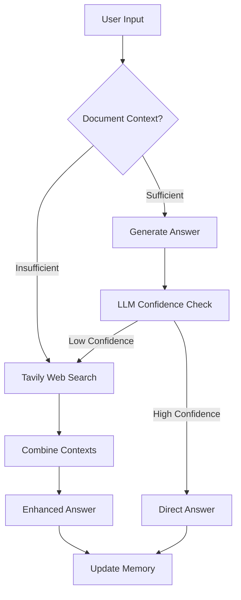

# Context-Aware QA Assistant with Dynamic Web Search

## Project Overview
This repository showcases an advanced QA Assistant that unites document-centric retrieval with dynamic web search, leveraging GPT-4 and LLM-as-judge decision logic. Built for both enterprise operations and research environments, the system employs a parent–child document hierarchy with Voyage-3-large embeddings in Qdrant to maintain conversational context, while seamlessly triggering Tavily-powered web searches when on-the-fly information is needed.

## Key Achievements
- **Context Preservation**: Engineered a hierarchical parent–child chunking framework that retains deep document context across multi-turn dialogues.

- **Dynamic Search Triggering**: Implemented a confidence-driven LLM-as-judge mechanism that invokes cost-efficient web searches only when document context is insufficient.

- **Hybrid Retrieval**: Combined static vector search (Qdrant) with on-demand Tavily API queries to ensure answers are both authoritative and up-to-date.

- **Scalable Deployment**: Designed for cloud-native deployment on Azure, AWS, or GCP, with Dockerized components and CI/CD integration for continuous delivery.

## Key Features

- **Hybrid Retrieval System**

  - Parent-child document architecture for context preservation
  - Voyage-3-large embeddings with Qdrant vector store
  - Chunking with configurable text splitting

- **LLM-Powered Intelligence**

  - GPT-4 based answering with conversation memory
  - LLM-as-judge for web search triggering
  - Confidence-based search decision making

- **Web Integration**
  - Tavily API for precision web searching
  - Context-aware result integration
  - Cost-efficient search triggering

## Workflow Diagram

## Technical Competencies:
- **Natural Language Processing**: Expertise in RAG (Retrieval-Augmented Generation), text chunking, semantic embeddings (Voyage-3-large), and vector search (Qdrant).

- **Large Language Models**: Hands-on experience with GPT-4, LangChain orchestration, and LLM-as-judge patterns for dynamic decision-making.

- **Search & Web Integration**: Integrated third-party APIs (Tavily) for context-aware web searches, combining real-time data with static document stores.

- **Cloud & Infrastructure**: Proficient in deploying ML services on Azure, AWS (SageMaker, Lambda), and GCP; containerized with Docker and managed via CI/CD pipelines.

- **Software Engineering**: Strong background in Python development, modular architecture design, Git-based workflows, unit testing (pytest), and performance optimization.

