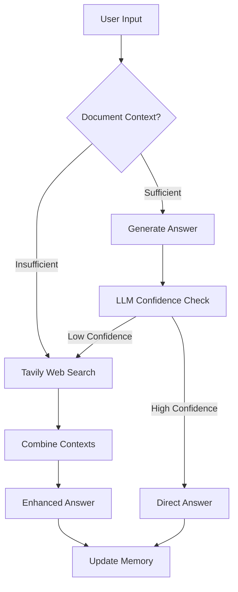

# Context-Aware QA Assistant with Dynamic Web Search

An intelligent question-answering system that combines document retrieval with web search capabilities, using LLM-as-judge decision making.

## Key Features

- **Hybrid Retrieval System**

  - Parent-child document architecture for context preservation
  - Voyage-3-large embeddings with Qdrant vector store
  - Chunking with configurable text splitting

- **LLM-Powered Intelligence**

  - GPT-4 based answering with conversation memory
  - LLM-as-judge for web search triggering
  - Confidence-based search decision making

- **Web Integration**
  - Tavily API for precision web searching
  - Context-aware result integration
  - Cost-efficient search triggering

## Workflow Diagram

